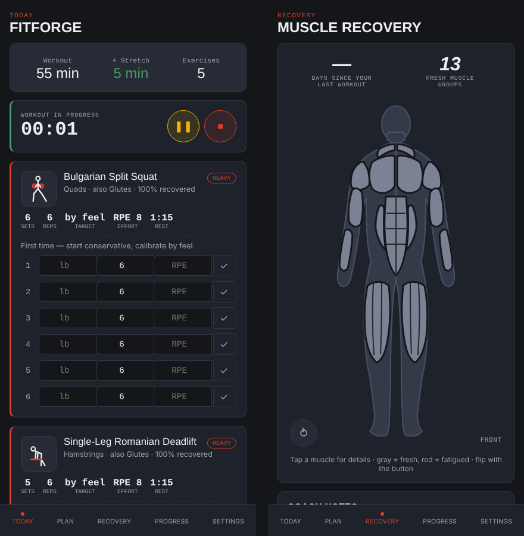

# FitForge

Self-hosted, AI-assisted workout planner. Tracks per-muscle recovery, adapts
weight/reps/sets over time based on your logged RPE, filters exercises to
equipment you actually have, and builds a full routine that fits the time
you tell it you have. Installable as a PWA on your phone.



## Two versions in this repo

| Folder | What it is |
| --- | --- |
| `/` (root) | The self-hosted server: Node.js and Express with a vanilla JS PWA front end and a flat-file store. Single workouts, recovery tracking, progression, optional weekly AI review. |
| `web/` | A later single-file React build of the same engine that runs entirely in the browser. Adds a weekly routine generator, heavy/moderate/light tiers, rest timers and a workout stopwatch, a tappable front/back recovery body map, and animated movement previews for all 153 exercises. The screenshot shows this version. |

To run the browser version:

```
cd web
npm install
npm run dev
```

It saves to the browser's local storage. Its "Run AI review" button calls the
Anthropic API directly without a key, which only worked in the sandbox where it
was first built; use the server version for a working AI review.

## How the "AI" works (hybrid)

- **Daily logic (no API calls, fully offline):** a rules-based engine
  handles muscle recovery decay, exercise selection, and progressive
  overload every time you generate a workout. This is instant and free.
- **Weekly review (optional, uses the Claude API):** once a week the server
  sends a summary of your last 2 weeks of training (sets, RPE, muscle
  distribution — no personal identifying info) to Claude, which returns
  volume adjustments and deload flags. This tunes the daily engine; it does
  not replace it. Skipped automatically if no API key is set.

## Setup

1. Requires Node.js 18+.
2. From this folder:
   ```
   npm install
   cp .env.example .env
   ```
3. (Optional) Open `.env` and add your `ANTHROPIC_API_KEY` to enable the
   weekly review. Get one at https://console.anthropic.com — this is billed
   per-use on your own account, separate from any Claude subscription.
4. Start it:
   ```
   npm start
   ```
5. Visit `http://<your-server-ip>:4477` from your phone's browser (same
   network, or through whatever reverse proxy / VPN you use for your home
   server). Tap Share → "Add to Home Screen" (iOS) to install it as an app.

## Running it long-term on your home server

- Use `pm2` or a systemd service to keep it running:
  ```
  npm install -g pm2
  pm2 start server.js --name fitforge
  pm2 save
  ```
- All data lives in `data/store.json`, a single flat JSON file that is easy
  to include in any sync or backup job.
- No native/compiled dependencies (deliberately avoided better-sqlite3 etc.)
  so this runs the same on a Raspberry Pi, an old mini PC, or a NAS with
  Node installed — no build toolchain needed.

## Project structure

```
server.js              Express entry point + weekly review scheduler
lib/db.js               Flat-file JSON datastore
lib/recovery.js          Per-muscle recovery decay model
lib/progression.js       Progressive overload rules
lib/generator.js         Ties recovery + progression + equipment + time budget
lib/claudeReview.js      Weekly Claude API call for plan tuning
routes/api.js            REST API
db/exercises.json        153-exercise library
public/                  Frontend (vanilla JS PWA, no build step)
web/                     Browser-only React version (Vite)
data/store.json          Created on first run — your equipment, settings, logs
```

## API reference

- `GET /api/exercises` — full library
- `GET/PUT /api/equipment` — `{ available: [...codes] }`
- `GET/PUT /api/settings` — `{ goal, weeklyReviewEnabled, units }`
- `GET /api/recovery` — current per-muscle recovery %
- `POST /api/workout/generate` — `{ durationMinutes, focusMuscles? }` → full workout
- `GET /api/sessions` / `POST /api/sessions` — workout logs
- `GET /api/progress/:exerciseName` — history for a single lift
- `POST /api/review/run` — trigger the Claude review manually
- `GET /api/review/notes` — latest coach notes/adjustments

## Extending it

- Equipment list lives in `public/app.js` (`EQUIPMENT_OPTIONS`) and must
  match the equipment codes used in `db/exercises.json`.
- To add exercises, just append objects to `db/exercises.json` following the
  existing shape (`primary`, `secondary`, `equipment`, `category`,
  optional `unilateral`).
- Recovery half-lives per muscle group are tunable in `lib/recovery.js`.
- Rep ranges / set counts per goal are tunable in `lib/progression.js`
  (`GOAL_SCHEMES`).
